# WEB(HTML & CSS)

---

## set1

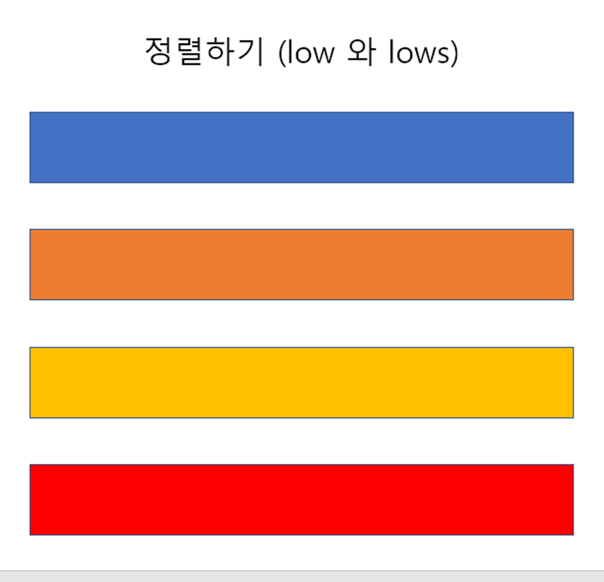

<문제>

1. 위와 같이 주어진 페이지에서 페이지의 크기가 md 사이즈보다 클경우  2개씩 나오도록 설정하시오(low)

   ```html
   <div class="ㅡㅡㅡㅡㅡ">
             <div class="item ㅡㅡㅡㅡㅡ">item1</div>
             <div class="item ㅡㅡㅡㅡㅡ">item2</div>
             <div class="item ㅡㅡㅡㅡㅡ">item3</div>
             <div class="item ㅡㅡㅡㅡㅡ">item4</div>
   </div>
   ```

2. 위의 답과 다른 방법으로 한번더 표현하시오(lows)

   ```html
   <div class="ㅡㅡㅡㅡㅡ">
             <div class="item ㅡㅡㅡㅡㅡ">item1</div>
             <div class="item ㅡㅡㅡㅡㅡ">item2</div>
             <div class="item ㅡㅡㅡㅡㅡ">item3</div>
             <div class="item ㅡㅡㅡㅡㅡ">item4</div>
   </div>
   ```

 3. 한줄에 나타내는데  비율을 1 : 3 : 5 : 3 로 나타내시오.

    ```html
    <div class="ㅡㅡㅡㅡㅡ">
              <div class="item ㅡㅡㅡㅡㅡ">item1</div>
              <div class="item ㅡㅡㅡㅡㅡ">item2</div>
              <div class="item ㅡㅡㅡㅡㅡ">item3</div>
              <div class="item ㅡㅡㅡㅡㅡ">item4</div>
    </div>
    ```


<정답>

1. ```html
   <div class="row">
             <div class="item col12 col-md-6">item1</div>
             <div class="item col12 col-md-6">item2</div>
             <div class="item col12 col-md-6">item3</div>
             <div class="item col12 col-md-6">item4</div>
   </div>
   ```

2. ```html
   <div class="row row-cols-1 row-cols-md-2">
             <div class="item col">item1</div>
             <div class="item col">item2</div>
             <div class="item col">item3</div>
             <div class="item col">item4</div>
   </div>
   ```

3. ```html
   <div class="row">
             <div class="item col-1">item1</div>
             <div class="item col-3">item2</div>
             <div class="item col-5">item3</div>
             <div class="item col-3">item4</div>
   </div>
   ```

---

## set2

1. 다음 중 내용(text)이 있는 태그는 무엇인가?

   ① br
   ② hr
   ③ img
   ④ link
   ⑤ a

   

2. 시멘틱 태그가 아닌 것은?

   ① table
   ② h1
   ③ span
   ④ nav
   ⑤ footer

   

3. 시맨틱 웹이란 무엇인지 서술하시오.

   

4. 다음중 HTML의 그룹 컨텐츠인 것은?

   ① i
   ② em
   ③ img
   ④ span
   ⑤ p

   

5. 다음 중 input의 공통 속성이 아닌 것은?

   ① name
   ② placeholder
   ③ action
   ④ required
   ⑤ autofocus

   

6. CSS에서 3번째로 가장 많이 활용된 속성은 무엇인가?

   ① display
   ② width
   ③ color
   ④ font-size
   ⑤ margin-top

   

7. 결합자 형태와 역할을 서술하시오.

   ex) 
   자손 결합자 div span {}
   자식 결합자 div > span {}
   일반 형제 결합자 p ~ span {}
   인접 형제 결합자 p + span {} 

   

8. CSS Display에서 블록레벨 요소에 해당되지 않는 것은?

   ① div
   ② input
   ③ li
   ④ p
   ⑤ ol


> 1. (5): br, hr, img, link, meta 등의 태그는 내용(text)이 없다.
> 2. (3)
>    HTML5에서 새롭게 등장한 시멘틱테그: header, nav, aside, section, article, footer
>    그 외 시멘틱 테그들: h1, table
> 3. 웹 상에 수많은 웹 페이지들에 메타데이터(의미정보)를 부여하여 웹페이지를 의미와 관련성을 가지는 데이터베이스로 구축하고자 하는 노력으로 만들어진 웹
> 4. (5)
> 5. (3)
>    form의 기본 속성 : action, method
>    input의 공통 속성 : name, placeholder, required, autofocus
> 6. (5)
> 7.  -
> 8. (2)

---

## set3

1. 옳은 것을 고르시오.
   1. 표(table)를 만들 때에는 반드시 <th> 태그를 사용해야 한다. 

   2. HTML의 태그는 반드시 별도의 닫는 태그가 필요하다.

   3. HTML과 CSS는 각자 문법을 갖는 별개의 언어이다. 

   4. !important 선택자는 자주 사용해도 무방하다. 
   
    
   
2. 다음 중 CSS 우선순위를 골라라

   요소 선택자/ class 선택자/ id 선택자/ 소스 순서/ !important/ Inline style

    

3. USERNAME 글자를 클릭하면 아이디를 입력하는 input에 focusing이 되도록 하려면 어떻게 해야 하는가? (서술형)

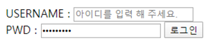


> 1. (3): 표를 만들 때 반드시 <th> 태그를 사용해야하는 것은 아님. 또한 HTML의 태그는 닫는 태그가 있어야하는 태그가 있고 없어도 되는 태그가 있다. 
> 2. !important > Inline style > id 선택자 > class 선택자 > 요소 선택자 > 소스 순서
> 3. 해당 label과 input 태그 안에 각각 for=”user” 과 id=”user”를 입력해야 한다. user라는 단어는 예시이며 동일한 단어를 입력하면 된다. 

---

## set4

1. CSS 상속: 다음 보기 중 상속 되지 않은 속성이 아닌 것은?

   1) margin

   2) position

   3) visibility

   4) box-sizing

   5) padding
   
   
   
2. 부모, 자식 선택자: 다음과 같은 코드가 주어졌을 때 출력된 모습으로 올바른 것은?

```html
<head>
    <style>
        ul li{
            color:red;
        }
        #lecture>li{
        	border:1px solid red;
        }
    </style>
</head>
<body>
	<ul>
		<li>HTML</li>
		<li>CSS</li>
		<li>JavaScript</li>
	</ul>
	<ol id = "lecture">
		<li>HTML</li>
		<li>CSS
			<ol>
				<li>selector</li>
				<li>declaration</li>
			</ol>
		</li>
		<li>JavaScript</li>
		...이하 생략
```

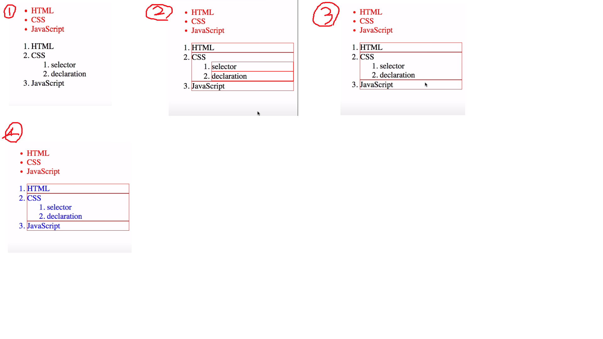

​	

3. Bootstrap spacing: 다음 보기 중 올바르게 짝지어지지 않은 것은?

|      | class name | rem  | px   |
| ---- | ---------- | ---- | ---- |
| 1    | m-1        | 0.25 | 4    |
| 2    | m-2        | 0.5  | 8    |
| 3    | m-3        | 1    | 16   |
| 4    | m-4        | 2    | 32   |
| 5    | m-5        | 3    | 48   |


> 1. (3): visibility는 Text와 관련된 요소로서 상속 된다.
>
>    - 상속 되는 것(Text 관련 요소(font, color, text-aligin), opacity, visibility)
>    - 상속 되지 않는 것(Box model 관련 요소(width, height, margin, padding, border, box-sizing, display), position 관련 요소(position, top/right/botton/left, z-index))
>
> 2. (3)
>
>    ul li는 자손결합자로 이 웹페이지에 있는 모든 ul 밑에있는 li에 대해 해당 사항을 적용한다.
>
>    #lecture>li는 자식결합자로 lecture바로 아래의 li요소에 해당 사항을 적용한다.
>
>    때문에 ol 밑에 있는 li 요소인 selector과 declaration에는 적용되지 않는다.
>
> 3. (4): m-4의 rem은 1.5이고, px는 24이다.

---

## set5

1. 다음 중 틀린 것을 고르시오.
   1. 클래스 선택자는 (.), 아이디 선택자는 (#)이다.
   2. CSS 적용 우선순위는 인라인, id 선택자, class 선택자, 요소 선택자 순이다.
   3. CSS 속성 중 width는 자식에게 상속 가능하다.
   4. 일반형제 결합자는 ~, 인접형제 결합자는 +이다.
   
   
   
2. 다음 중 틀린 것을 고르시오.
   1. DOM은 프로그래밍 언어가 DOM 구조에 접근할 수 있게 한다.
   2. 기본적으로 모든 요소의 box-sizing은 content-box이다.
   3. 내용 없는 태그에는 br, hr img, input, link, meta가 있다.
   4. 요소(element)의 여는 태그와 닫는 태그가 잘못 연결될 경우 오류가 발생한다.

   

3. Float clear를 위한 코드를 완성하기 위한 a, b, c에 들어갈 내용을 쓰시오.

   ```css
   .clearfix>::after{
     content: ___(a)___;
     display: ___(b)___;
     clear : ___(c)___;
   }
   ```


> 1. (3): 상속가능 요소는 text 관련요소(font, color, text-align 및 opacity, visibility
> 2. (4): 오류가 아닌 그냥 레이아웃이 깨진 상태로 출력된다.
> 3. a: "", b: block, c: both

---

## set6

1. 다음 코드에 (1), (2), (3)에 들어갈 단어를 쓰시오

   ```html
   <!DOCTYPE html>
   <(1) lang="en">
   <(2)>
     <meta charset="UTF-8">
     <title>Document</title>
     ...
   </(2)>
   <(3)>
     <ul class="em">
       <li class="em">1.5em</li>
       <li class="rem">1.5rem</li>
       <li>no class</li>
     </ul>
   </(3)>
   </(1)>
   ```

   

2. 다음중 시멘틱 태그에 포함되지 않는것은?

   1 <section>

   2 <div>

   3 <h1>

   4 <footer>

   5 <table>
   
   
   
3. 상자 A와 B의 거리는 얼마인가?

   ```html
   <!DOCTYPE html>
   <html lang="en">
   <head>
     <meta charset="UTF-8">
     <meta http-equiv="X-UA-Compatible" content="IE=edge">
     <meta name="viewport" content="width=device-width, initial-scale=1.0">
     <title>Document</title>
     <style>
       *{
         box-sizing: border-box;
       }
       .A{
         width: 100px;
         height: 100px;
         margin: 16px;
         background-color: red;
       }
       .B{
         width: 100px;
         height: 100px;
         margin: 16px;
         margin-top: 32px;
         background-color: blue;
       }
     </style>
   </head>
   <body>
     <div class="A">
       A
     </div>
     <div class="B">
       B
     </div>
   </body>
   </html>
   ```


> 1. html, head, body
> 2. 2 <div>
> 3. 32px
>

---

## set7

1. (객관식) float 속성의 기본 값으로 알맞은 것은?
   1. none
   2. left
   3. right
   4. center
   
    
   
2. (서술형) flexbox에서 요소들이 강제로 한 줄에 배치 되게 할 것인지 여부를 설정하는 속성을 flex-wrap이라고 한다. flex-wrap을 따로 설정하지 않았을 경우 요소들이 차지할 수 있는 공간을 넘치게 되면 어떻게 되는지 서술하시오.

   

3. (객관식) flexbox에서 justify-content 속성을 이용하여 정렬하고자 할 때 다음과 같은 모양이 되기 위해서 지정해야 하는 속성으로 가장 올바른 것은?

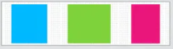

		1. center
		2. space-between
		3. space-around
		4. space-evenly


> 1. (1):  float의 기본 값은 none이다.
>
> 2. 자리가 없으면 공간을 튀어나온다.
>
>    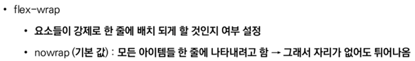
>
> 3. (3): space-around: 균등 좌우 정렬(내부 요소 여백은 외곽 여백의 2배)

---

## set8

1. 빈칸에 맞는 단어 쓰기

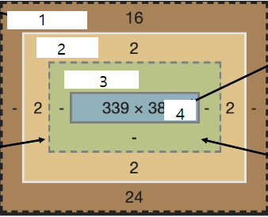

​	

2. 시맨틱 태그에 대한 설명으로 맞지 않는 것은?

   a. 의미 있는 정보의 그룹을 태그로 표현한다.

   b. 의미를 가지는 태그들을 활용하기 위한 노력이다.

   c. Non Semantic 요소는 div, span 등이 있고 h1, table 태그는 시맨틱으로 본다.

   d. 코드의 가독성 높이지만 유지 보수가 어렵다.
   
   
   
3. em과 rem에 대해 틀린것은?

   a. em은 html의 사이즈 기준에 배수 단위를 가진다.

   b. %는 가변적인 레이아웃에서 자주 사용한다.

   c. px는 고정적인 단위이다.

   d. rem 은 상속에 영향을 받지 않는다.


> 1. margin, border, padding, content
> 2. (d) - 유지 보수 쉬워진다.
> 3. (a) - em은 바로위 부모 요소에 대한 상속에 영향을 받는다

---

## set9

1. 결과를 보고 안에 들어갈 코드를 쓰시오.

<결과>

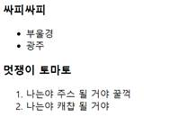

<코드>

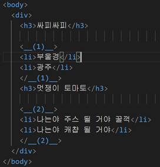

​	 

2. 해당 코드를 보고 (1)와 같은 크기를 가지는 텍스트를 쓰시오.

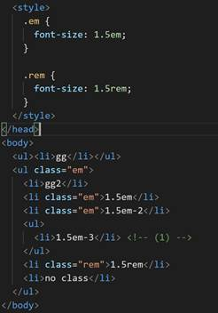

 	

3. Box model 구성요소를 모두 쓰고, 배경색 및 이미지가 적용되는 요소를 모두 쓰시오.

    

4. Box sizing을 따로 지정해 주지 않을 경우 width는 어느영역까지 적용되는지 쓰시오.


> 1. ul: ul(unordered list)특성에 따라 앞에 글머리 기호가 붙습니다.
>
>    ol: ol(ordered list)특성에 따라 앞에 숫자형태로 기호가 붙습니다.
>
> 2. gg2 .1.5rem, no class
>
> 3. 구성요소 : content, padding, border, margin 
>
>    배경색 적용 : content, padding
>
> 4. contents 영역

---

## set10

1. 다음은 html의 기본구조에 대한 설명이다. 옳지 않은 것을 고르시오.
   1. markup 언어란 웹컨텐츠의 의미와 구조를 정의하는 언어이다.
   2. hr, p와 같은 태그는 그룹 컨텐츠에 속한다.
   3. form은 input에서 입력한 데이터를 기반으로 서버에서 처리될 데이터를 제공하는 역할을 한다.
   4. button태그는 기본행동을 가지지 않으며, value를 레이블로 사용하는 푸시버튼 기능이다.
   5. head요소는 해당 문서의 정보를 담고 있고, 브라우저에서도 확인할 수 있다.
   
   
   
2. b태그와 strong 태그의 공통점 및 차이점을 서술하시오. 

   

3. div태그와 span태그의 공통점과 차이점을 서술하시오.

   

4. 속성의 작성 방식 중 옳은 것을 고르시오.

    1. <a href = 'https://google.com'>

    2. <a href= 'https://google.com'>

    3. <a href = "https://google.com">

    4. <a href='https://google.com'>

    5. <a href="https://google.com">

    

5. 다음의 인라인 디스플레이의 설명 중 옳은 것을 고르시오.
   1. 줄 바꿈이 일어나는 행의 일부 요소이다.
   2. content 높이만큼 세로 폭을 차지한다.
   3. width, height, margin-top, margin-bottom을 지정할 수 있다.
   4. 상하의 여백은 line-height로 지정한다.
   5. 블럭 요소 안에 들어갈 수 없다.

   

6. 다음 중 인라인 레벨 요소가 아닌 것을 고르시오.

   1. img
   2. form
   3. span
   4. em
   5. label


> 1. (5): head요소는 브라우저에 나타나지 않으며, body요소부터 브라우저에 나타난다.
>
> 2. b태그와 strong태그 모두 글자를 굵게 출력하는 기능은 동일하지만, b태그의 경우 단순히 글자를 굵게 만드는 반면 strong태그는 문자의 중요도도 표현하는 시맨틱한 기능도 함께 가지고 있다. 이는 웹페이지의 접근성 측면에서 중요하다.
>
> 3. div태그와 span태그 모두 non-semantic 태그(별 다른 의미가 없는 태그)이지만, div태그는 블럭요소, span태그는 인라인요소이다.
>
> 4. (5) - = 전후의 공백은 없어야하고, 쌍따옴표를 사용한다.
>
> 5. (4): (1) 줄 바꿈이 일어나지 않는 행의 일부 요소이다.(2) content의 너비만큼 가로폭을 차지한다.
>
>    (3) 지정할 수 있다.
>
>    (5) 블럭 요소 안에 들어갈 수 있다.
>
> 6. (2): form은 대표적인 블록 레벨 요소 중 하나이다.

---

## set11

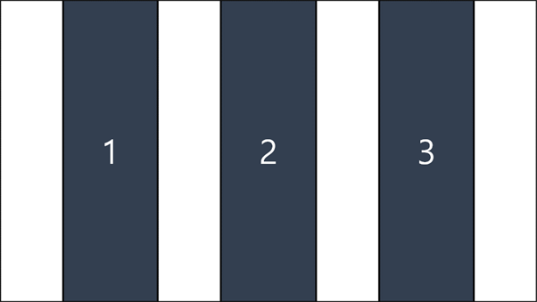


1. 다음과 같이 정렬하려면 어떤 속성을 설정해야 하는가? (단 flex-direction은 row로 설정되어있다)

   (1) justify-content: space-around;

   (2) justify-content: space-evenly;

   (3) align-items: space-around;

   (4) align-items: space-evenly;

   

2. 다음 중 시맨틱 태그가 아닌 것을 골라라.

   (1) h1

   (2) table

   (3) span

   (4) section

   

3. 다음 중 CSS 적용 우선순위가 올바르게 나열된 것은? (우선순위가 높은 것부터 낮은 순으로)

   (1) !important > 인라인 > class 선택자 > id 선택자 > 요소 선택자 > 소스 순서

   (2) !important > 인라인 > id 선택자 > class 선택자 > 요소 선택자 > 소스 순서

   (3) !important > 인라인 > 요소 선택자 > id 선택자 > class 선택자 > 소스 순서

   (4) !important > id 선택자 > class 선택자 > 요소 선택자 > 인라인 > 소스 순서

 


> 1. 정답 : (2)
>
>    풀이 : main 축을 기준으로 정렬하기 때문에 justify-content 속성을 이용해야 한다. space-evenly는 내부 요소 여백과 외각 여백을 모두 동일하게 균등 정렬하는 속성이기 때문에 justify-content: space-evenly 속성을 설정해주어야 한다. (space-around는 내부 요소의 여백을 외곽 여백의 2배로 설정하여 균등 정렬하는 속성이다)
>
> 2. 정답 : (3)
>
>    풀이 : 나머지는 모두 의미를 가지는 시맨틱 태그에 해당한다. 여러 시맨틱 태그 중 HTML5에서 새로 등장한 시맨틱 태그는 **header**(문서 전체나 섹션의 헤더), **nav**(내비게이션), **aside**(사이드에 위치한 공간, 메인 콘텐츠와 관련성이 적은 콘텐츠), **section**(문서의 일반적인 구분), **article**(문서, 페이지, 사이트 안에서 독립적으로 구분되는 영역), **footer**(문서 전체나 섹션의 마지막 부분)가 있다
>
> 3. 정답 : (2)
>
>    풀이 : CSS 적용은
>    !important > 인라인 > id 선택자 > class 선택자 > 요소 선택자 > 소스 순서 순위로 적용된다.

---

## set12

1. 일반형제 결합자와 인접 형제 결합자: 다음의 코드에서

   css

   ```css
       p ~ .color-blue{
         color: blue;
       }
   
       p + p.color-red{
         color: red;
       }
   ```

   html

   ```html
     <p>p 아래 색은 무엇인가</p>
     <h1 class="color-blue color-red">color1</h1>
     <span class="color-blue color-red">color2</span>
     <hr>
     <p class="color-blue color-red">color3</p>
     <p class="color-blue color-red">color4</p>
   ```

   color3의 색은?, color4의 색은 ?

   

2. float: 다음 중 틀린 것은?
   1. float은 상 요소가 정상 흐름으로부터 빠져 텍스트 및 인라인 요소가 그 주위를 감싸 요소의 좌, 우측을 따라 배치되어야 함을 지정
   2. float 요소를 더 이상 사용하지 않을 땐 clear : both를 입력할 수 있다
   3. 블록속성이 float을 감싼다
   4. floatd은 열 레이아웃을 만드는데 사용된다

   

3. shorthand

   flex-direction 과 flex-wrap 를 shorthand로 사용하는 코드는?

   

4. bootstrap

   1. margin-left : 16px을 bootstrap class로 표현한다면?

   2. display : flex; 를 bootstrap class로 표현한다면?

   3. 요소간의 padding 값을 나타내는 bootstrap class는?

   4. 가장 기본이 되는 class 로 columns의 상위에 작성되어야 하는 class는?


> 1. color3 = blue
>
>    color4 = red
>
> 2. (3): 블록속성은 float을 감싸지 않는다
>
> 3. flex-flow
>
> 4. 1. ms-3
>
>    2. d-flex
>
>    3. gutters
>
>    4. row

---

## set13

1. 다음 bootstrap.css에서 해당 역할을 수행하는  (a)의 class name은?

   ```css
   .__(a)__ {
     margin-right: 0 !important;
     margin-left: 0 !important;
   }
   ```
   
   
   
2. 아래 이미지는 로그인 form을 생성하는 HTML 코드이다. 이름 글자를 클릭하면 아이디를 입력하는 칸에, 비밀번호 글자를 클릭하면 비밀번호를 입력하는 칸에 focusing 되도록 하는 (a)와 (b)의 태그를 작성하시오

   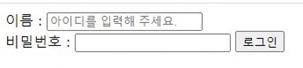

   ```html
   <body>
     <div>
       <__(a)__ for="Username">아이디 :</__(a)__>
       <__(b)__ type="text" id="Username" placeholder="아이디를 입력해 주세요."><br>
       <__(a)__ for="PWD">비밀번호 :</__(a)__>
       <__(b)__ type="password" id="PWD">
       <__(b)__ type="submit" value="로그인">
     </div>
   </body>
   ```

   

3. 다음은 CSS display에 관한 설명이다. 옳지 않은 것은?
   1. display: block 은 블록 레벨 요소 안에 인라인 레벨 요소가 들어갈 수 있다.
   2. display: inline 은 width, height, margin-top, margin-bottom을 지정할 수 있다.
   3. display: none 은 해당 요소를 화면에 표시하지 않으며, 공간조차 사라진다.
   4. ul, form, div, hr 은 블록 레벨 요소이다.

   

4. 다음은 CSS position에 관한 설명이다. 옳지 않은 것은?
   1. relative 는 레이아웃에서 요소가 차지하는 공간이 static일 때와 같다.
   2. absolute 는 요소를 일반적인 문서 흐름에서 제거 후 레이아웃에 공간을 차지하지 않게 한다.
   3. fixed 는 부모요소를 기준으로 이동한다.
   4. static 은 모든 태그의 기본 값이다.

   

5. 다음은 CSS에 관한 설명이다. 옳지 않은 것은?

   1. CSS 적용 순위는 !important > Inline 선택자 > class 선택자 > 요소 선택자 > 소스 순서 이다.

   2. CSS는 상속을 통해 부모 요소의 속성을 모두 자식에게 상속한다.

   3. Box model의 구성 중 아래의 선택자는

      ```css
      .margin-3{
          margin: 10px 20px 30px;
      }
      ```

      margin-top: 10px; margin-left, margin-right: 20px; margin-bottom: 30px; 이 적용된다.

   4. CSS selectors 중 일반 형제 결합자는 selector A의 형제 요소 중 뒤에 위치하는 selector B 요소 모두에 적용된다.


> 1. mx-0
>
> 2. (a) label, (b) input
>
> 3. (2): block: inline 은 width, height, margin-top, margin-bottom 을 지정할 수 없다.
>
>    block과 같이 width, height, margin 속성을 모두 지정할 수 있는 것은 inline-block 요소이다.
>
> 4. (3): fixed는 부모요소와 관계없이 viewport를 기준으로 이동한다.
>
> 5. (2): 속성 중에는 상속 되는 것과 상속되지 않는 것들이 있다.
>
>    상속 되는 것 예시: text 관련 요소(font, color, text-align), opacity, visibility 등
>
>    상속 되지 않는 것 예시: Box model 관련 요소(width, height, margin, padding, display), position 관련 요소(position, top/right/bottom/left, z-index) 등

---

## set14

1. 다음 형태의 정렬방식에서, A와 B에 들어갈 단어는?

   ```
   _ A _ _ B _ _ C _
   justify-content: A
   A _ _ _ B _ _ _ C
   justify-content: B
   ```

   

2. bootstrap 에서 fw-noraml이 의미하는 것은?

   

3. text-align: right 과 같은 효과를 나타내고자 한다. XXXX와 YYYY에 들어갈 단어는?

   ````
   margin-XXXX:YYYY
   ````

   

4. display: 속성으로 가능한 것 4가지는?

   

5. absolute의 기준은?

   

6. 다음 CSS가 적용될 경우, 아래쪽 margin의 크기는?

   ```css
   .margin{
   margin: 10px 20px 30px
   }
   ```

   

7. 이미지를 적용할 경우, 박스의 어디까지 적용되는가?

   

8. position 관련 요소는 상속이 되는가? (O/X)

   

9. 다음 html에서 출력되는 4, 5의 색은?

   ```html
   <style>
     .green{
   	color: green;
     }
     .white {
   	color: white;
     }
   </style>
   ...
   <p class="green white">	4 </p>
   <p class="white green"> 5 </p>
   ```

   

10. 서버에서 처리될 데이터를 제공하는 태그는?

    

11. (div, span, h1, table) 중 시맨틱 태그의 개수는?

    

12. 요소가 중첩된 상태에서 여는 태그가 있고, 닫힌 태그는 없을 때 오류를 반환하는가? (O/X)


> 1. A: space-around
>
>    B: space-between
>
> 2. 글씨 크기 보통
>
> 3. XXXX: left
>
>    YYYY: auto
>
> 4. block, inline, inline-block, none
>
> 5. 부모/조상 요소 (없는 경우, body에 붙는 형태)
>
> 6. 30px
>
> 7. padding
>
> 8. X. text 관련 요소만 상속 가능하다.
>
> 9. 4: white
>
>    5: white
>
> 10. form 태그
>
> 11. 2개 (h1, table)
>
> 12. X. 오류 없이 레이아웃이 깨진 형태로 출력한다.

---

## set15

1. 다음중 display (block과 inline)의 설명중 옳지 않은 것 모두 고르시오.
   1. 블록요소 안에는 인라인 태그와 블록 태그가 올 수 있다.
   2. 인라인 요소안에는 인라인 태그와 블록 태그가 올 수 있다.
   3.  <p>태그 요소 안에는 인라인 태그와 블록태그가 올 수있다.
   4. 인라인 요소에는 margin을 지정할 수 없다.

   

2. input 태그의 타입 checkbox 과 radio 중 중복 선택이 가능한 것은?

   

3. 오른쪽 정렬을 margin 과 text-align을 이용하여 각각 표시하시오

   

4. #sect1 > ul > li: nth-child(1) 을 풀어서 설명하시오

   

5. margin의 숏핸드 표현중 1개 2개 3개 의 값을 줬을때의 각각의 의미는?

   

6. 다음 css가 적용된 box의 (margin 끝에서 끝까지)너비는?

   ```css
   .box {
   width: 100px;
   margin: 20px 15px 30px;
   pading-left: 20px;
   border : 2px solid black;
   }
   ```


> 1. (2), (3), (4)
>    (2) - 인라인 요소에는 인라인 요소만 올 수 있다.
>    (3) - p태그는 블록이지만 자식으로 인라인만 올 수 있다.
>    (4) - 인라인 요소에는 margin-top 과 bottom을 지정할 수 없는 것이고 margin-left와 right는 적용된다.
> 2. checkbox
> 3. margin-left: auto
>    text-align : right
> 4. id sect1 의 자식인 ul 의 자식 li중 1번째
> 5. 1개: 상하좌우
>    2개: 상하 / 좌우
>    3개: 상/좌우/하
> 6. 100 + 20 + 2\*2 + 15\*2 = 154px

