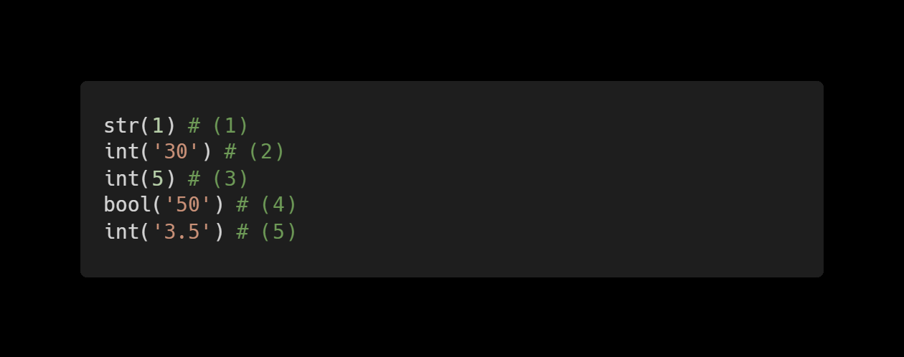
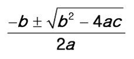

# HomeWork

## 2021.07.19
### 부울경 2반 박상준

#### 1. Python 예약어

python 에서 사용할 수 없는 식별자 예약어 를 찾아 작성하시오

``` python
import keyword
print(keyword.kwlist)

['False', 'None', 'True', '__peg_parser__', 'and', 'as', 'assert', 'async', 'await', 'break', 'class', 'continue', 'def', 'del', 'elif', 'else', 'except', 'finally', 'for', 'from', 'global', 'if', 'import', 'in', 'is', 'lambda', 'nonlocal', 'not', 'or', 'pass', 'raise', 'return', 'try', 'while', 'with', 'yield'] 
```

---

#### 2. 실수 비교

python은 부동소수점 방식을 이용하여 실수 ( 를 표현하는 과정에서 , 나타내고자 하는
값과의 오차가 발생하여 원하는 대로 연산 또는 비교가 되지 않을 때가 있다 . 이를 참고하
여 , 아래와 같은 두 실수 값을 올바르게 비교하기 위한 코드를 작성하시오.

```python
num1 = 0.1 * 3
num2 = 0.3

#그냥하면
print(num1 == num2) #false

#sys상 machine epslion
import sys
print(abs(num1 - num2) <= sys.float_info.epsilon) #true
print(sys.float_info.epsilon)

#math 모듈 (python 3.5이상)
import math
print(math.isclose(num1, num2)) #true
```

---

#### 3. 이스케이프 시퀀스

(1) 줄 바꿈, (2) 탭, (3) 백슬래시를 의미하는 이스케이프 시퀀스를 작성하시오.

```python
(1) \n
(2) \t
(3) \\
```
---

#### 4. String Interpolation

‘안녕, 철수야’를 string interpolation을 사용하여 출력하시오.

```python
name = '철수'

#% formatting
print('%s' %name)

#str.formatting
print('{0}'.format(name))

#f-strings (python3.6 이상)
print(f'{name}')
```
---

#### 5. 형 변환

다음 중, 실행 시 오류가 발생하는 코드를 고르시오.



```python
(5) int 정수 들어가야함
```
---

#### 6. 네모 출력

두 개의 정수 n과 m이 주어졌을 때, 가로의 길이가 n, 세로의 길이가 m인 직사각형 형태를
별(*) 문자를 이용하여 출력하시오. 단, 반복문은 사용할 수 없다.

```python
#반복문 사용 불가능
n = 5 #가로
m = 9 #세로

print((('*' * n) + '\n') * m)
# print('*' * n + '\n' + '*' * m) 이래서 안나옴..
```
---

#### 7. 이스케이프 시퀀스 응용

print() 함수를 한 번만 사용하여 다음 문장을 출력하시오.


```python
#print 한번만 쓰기
print('\"파일은 C:\\Window\\Users\\내문서\\python에 저장이 되었습니다.\" \n나는 생각했다. \'cd를 써서 git bash로 들어가봐야지. \'')
```
---

#### 8. 근의 공식

다음은 이차 방정식의 근을 찾는 수식이다. 이를 파이썬 코드로 작성하시오.



```python
#근의 공식 구하기
a = int(input('a :'))
b = int(input('b :'))
c = int(input('c :'))

r1 = -b + (b ** 2 - 4*a*c)**0.5 / (2*a)
r2 = -b - (b ** 2 - 4*a*c)**0.5 / (2*a)

print(f'{r1} or {r2}')
```

